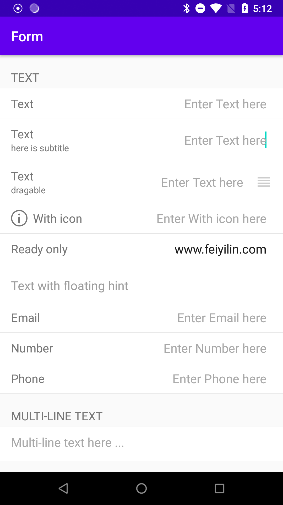
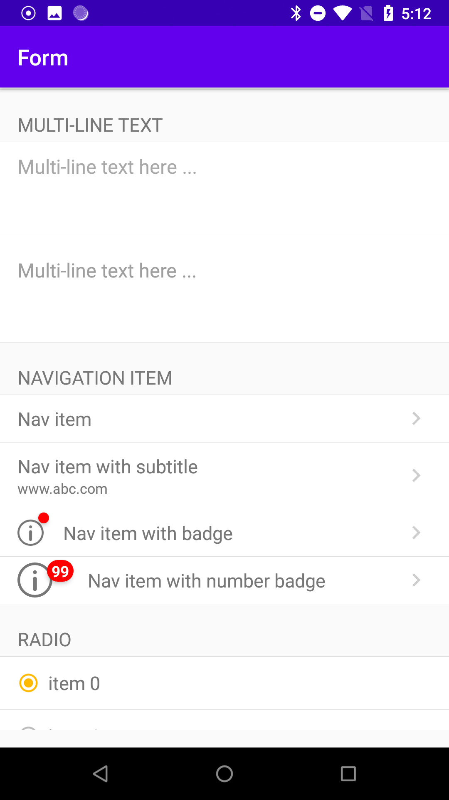
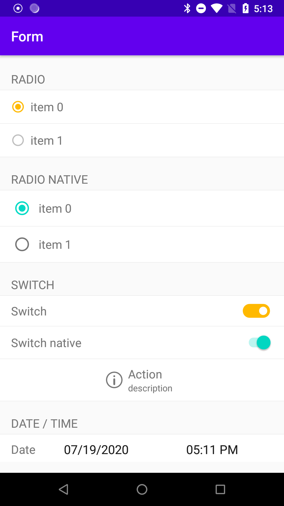
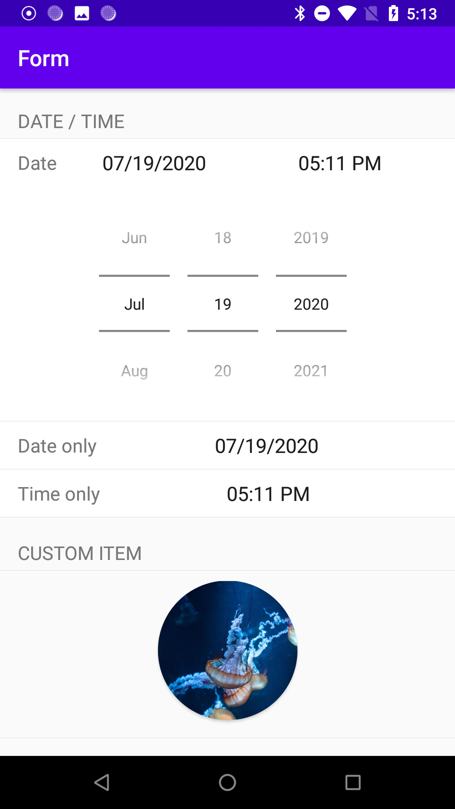

# Form in Kotlin for Android

   

# Usage
## 1. Add to project
Add **jcenter()** to repository in your project's build.gradle:
```gradle
allprojects {
    repositories {
        ...
        jcenter()
    }
}
```

Add **form** to dependencies in your app's build.gradle: 
```gradle
dependencies {
    ...
    implementation 'com.feiyilin:form:0.2'
}
```
## 2. Update Activity
Add a **RecyclerView** to the activity's layout
```xml
<?xml version="1.0" encoding="utf-8"?>
<androidx.constraintlayout.widget.ConstraintLayout
    xmlns:android="http://schemas.android.com/apk/res/android"
    xmlns:tools="http://schemas.android.com/tools"
    xmlns:app="http://schemas.android.com/apk/res-auto"
    android:layout_width="match_parent"
    android:layout_height="match_parent"
    tools:context="com.feiyilin.app.MainActivity">
    <androidx.recyclerview.widget.RecyclerView
        android:id="@+id/setting_profile_recyclerView"
        android:layout_width="match_parent"
        android:layout_height="match_parent"
        android:paddingBottom="16dp"
        android:descendantFocusability="beforeDescendants">

    </androidx.recyclerview.widget.RecyclerView>
</androidx.constraintlayout.widget.ConstraintLayout>
```
Add **FylFormItem** list to hold all **FylFormItem**
```kotlin
class MainActivity : AppCompatActivity() {
    private var settings = mutableListOf<FylFormItem>()
    
    ...
}
```
Add items to the list
```kotlin
class MainActivity : AppCompatActivity() {
    ...
    override fun onCreate(savedInstanceState: Bundle?) {
        super.onCreate(savedInstanceState)
        setContentView(R.layout.activity_main)
        
        settings = mutableListOf(
            FylFormItemSection().title("Text"),
            FylFormItemText().title("Text").tag("text"),
            FylFormItemText().title("Text").subTitle("here is subtitle").tag("text_subtitle"),
            FylFormItemText().title("Text").subTitle("dragable").dragable(true)
                .tag("text_dragable"),
            FylFormItemText().title("With icon")
            ...
            )
     }
 ...
 }
 ```
 Initialize **RecyclerView** with **FylFormRecyclerAdaptor**
```kotlin
class MainActivity : AppCompatActivity() {
    ...
    override fun onCreate(savedInstanceState: Bundle?) {
        super.onCreate(savedInstanceState)
        setContentView(R.layout.activity_main)
        ...
        recyclerView.apply {
            layoutManager = LinearLayoutManager(this@MainActivity)

            adapter = FylFormRecyclerAdaptor(settings, onSettingProfileItemClickListener).apply {
            }
        }
    }
}
```
# Using the callbacks
**FlyFormItemCallback** can be used to change the appearance and behavior of an item

* **onSetup**

    Called when the item is configured.
    
* **onValueChanged**

    Called when the value of an item changes.
    
* **onItemClicked**

    Called when an item is clicked.
    
* **onTitleImageClicked**

    Called when the title icon is clicked
    
* **onStartReorder**

    Called before moving/reordering an item. Return **true** from the callback to disable the default action.

* **onMoveItem**

    Called before finishing moving an item. Return **true** from the callback to disable the default action.

* **onSwipedAction**

    Called when a swipe action is triggered.

* **getMinItemHeight**

    Called when configure/bind an item. Can be used to update the minimum height for all (or a group of) items.

# Custom item
Design the layout of your item, e.g., **form_item_image.xml**
```xml
<?xml version="1.0" encoding="utf-8"?>

<androidx.constraintlayout.widget.ConstraintLayout
        xmlns:android="http://schemas.android.com/apk/res/android"
              xmlns:app="http://schemas.android.com/apk/res-auto"
              xmlns:tools="http://schemas.android.com/tools"
              android:layout_width="match_parent"
              android:layout_height="wrap_content"
              android:orientation="vertical">

    <androidx.cardview.widget.CardView
            android:id="@+id/profile_image_wrap"
            app:cardCornerRadius="63dp"
            android:layout_width="126dp"
            android:layout_height="126dp"
            android:layout_marginTop="9dp"
            android:layout_marginBottom="9dp"
            app:layout_constraintEnd_toEndOf="parent"
            app:layout_constraintStart_toStartOf="parent"
            app:layout_constraintTop_toTopOf="parent"
            android:layout_gravity="center_horizontal"
            app:cardBackgroundColor="#00FFFFFF">
        <ImageView
                android:id="@+id/formELementImage"
                android:layout_width="match_parent"
                android:layout_height="match_parent"
                android:adjustViewBounds="true"
                app:srcCompat="@drawable/form_image_placeholder"
                android:scaleType="fitCenter"/>
    </androidx.cardview.widget.CardView>

    <View
            android:layout_width="match_parent"
            android:layout_height="0.5dp"
            android:layout_marginTop="16dp"
            app:layout_constraintTop_toBottomOf="@+id/profile_image_wrap"
            android:background="#FFE0E0E0"/>
</androidx.constraintlayout.widget.ConstraintLayout>
```

Derive an item from **FylFormItem**,
```kotlin
open class FylFormItemImage : FylFormItem() {
    var image: Int = 0
}

fun <T : FylFormItemImage> T.image(image: Int) = apply {
    this.image = image
}
```
Derive a view holder class from **FylFormViewHolder**, and override **bind**
```kotlin
class FylFormImageViewHolder(inflater: LayoutInflater, resource: Int, parent: ViewGroup) :
    FylFormViewHolder(inflater, resource, parent) {
    private var imgView: ImageView? = null

    init {
        imgView = itemView.findViewById(R.id.formELementImage)
    }

    override fun bind(s: FylFormItem, listener: FlyFormItemCallback?) {

        if (s is FylFormItemImage) {
            Picasso.get().load(s.image).fit().centerInside().into(imgView)

            imgView?.setOnClickListener {
                listener?.onValueChanged(s)
            }
        }
    }
}
```

Register the item with **registerViewHolder**
```kotlin
class MainActivity : AppCompatActivity() {
    ...
    override fun onCreate(savedInstanceState: Bundle?) {
        super.onCreate(savedInstanceState)
        setContentView(R.layout.activity_main)
        ...
        recyclerView.apply {
            layoutManager = LinearLayoutManager(this@MainActivity)

            adapter = FylFormRecyclerAdaptor(settings, onSettingProfileItemClickListener).apply {
                this.registerViewHolder(
                    FylFormItemImage::class.java,
                    R.layout.form_item_image,
                    FylFormImageViewHolder::class.java
                )
            }
        }
    }
}
```


