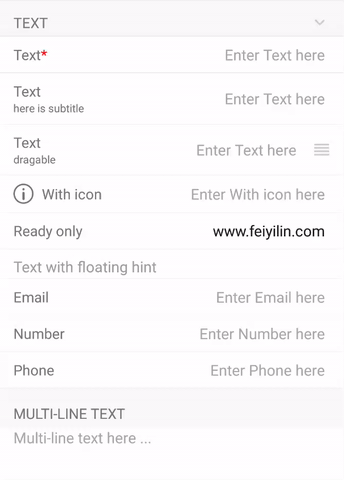
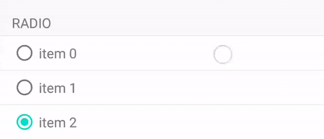
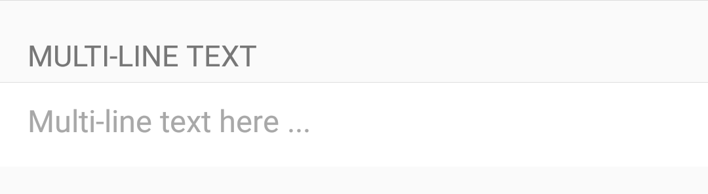
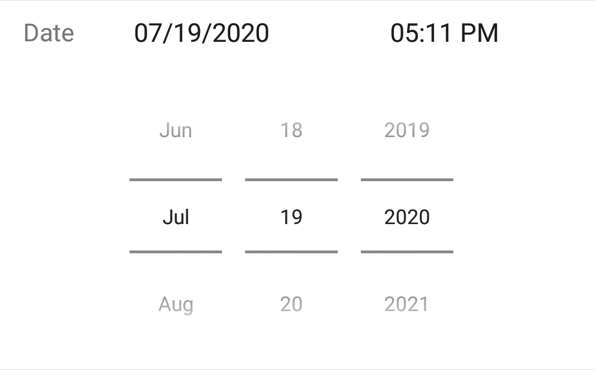
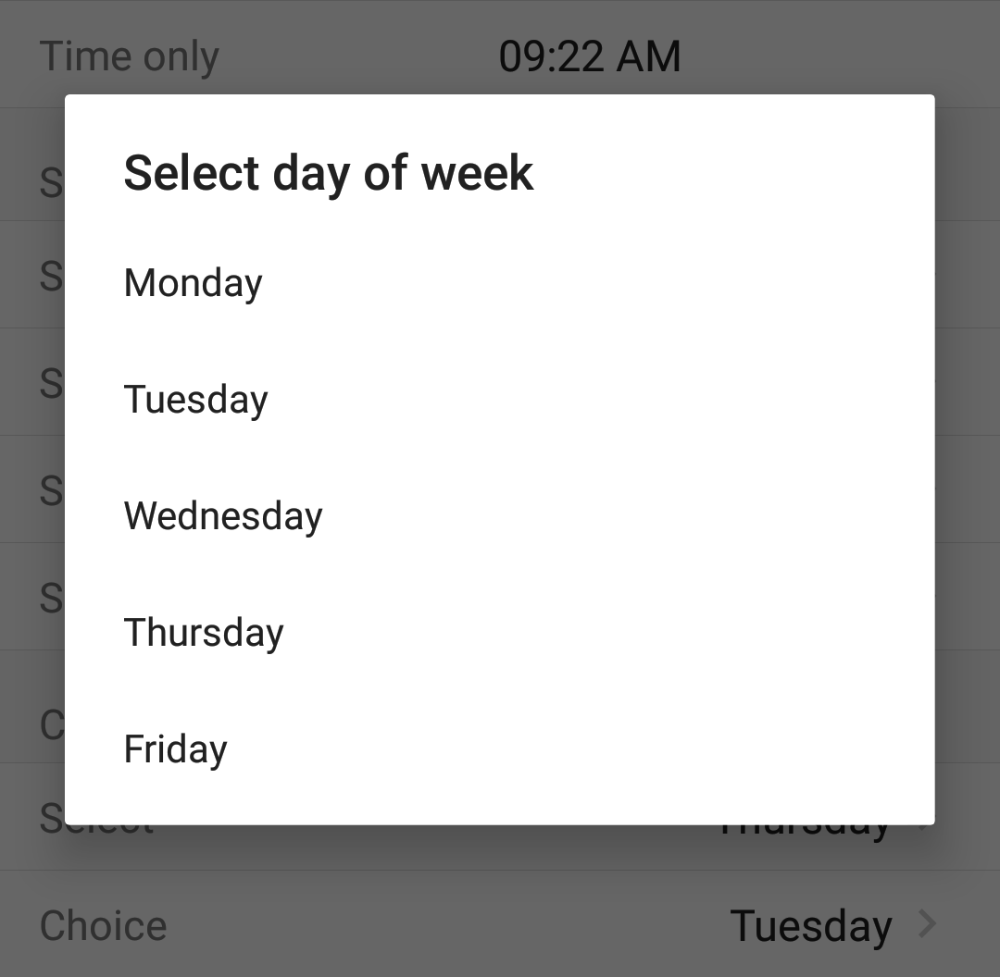
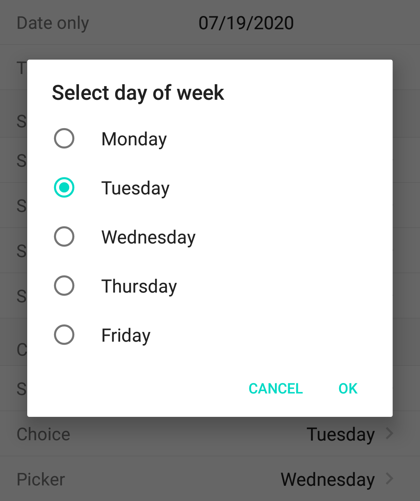
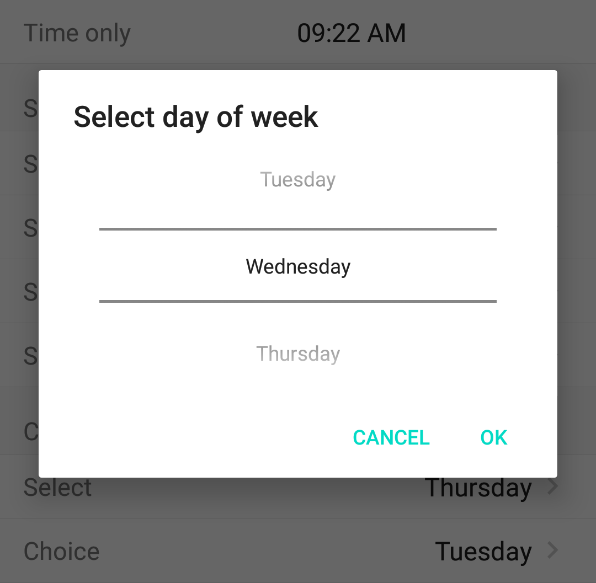
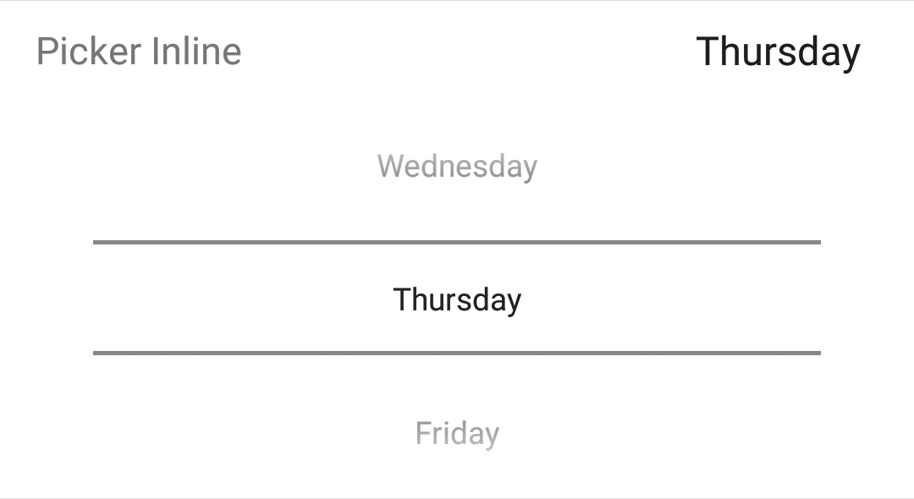
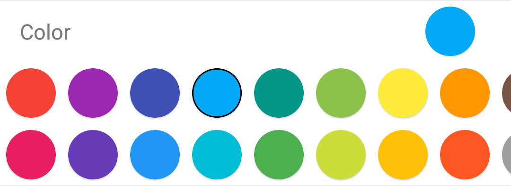

# Form: form builder in Kotlin for Android

   

# Usage
## 1. Add to project
Add **jcenter()** to repository in your project's build.gradle:
```gradle
allprojects {
    repositories {
        ...
        jcenter()
    }
}
```

Add **form** to dependencies in your app's build.gradle:
```gradle
dependencies {
    ...
    implementation 'com.feiyilin:form:0.3.2'
}
```
## 2. Update Activity
1. Add **FormItem** to the adapter

```kotlin
class MainActivity : FormActivity() {
    ...
    override fun initForm() {
        adapter?.apply {
            +FormItemSection().title("Text").tag("sec_text").apply {
                enableCollapse(true)
                +FormItemText().title("Text").tag("text").required(true)
                +FormItemText().title("Text").subTitle("here is subtitle").tag("text_subtitle")
                +FormItemText().title("Text").subTitle("draggable").draggable(true)
                    .tag("text_draggable")
                ...
            }
        }
     }
...
}
```
2. override the callbacks
```kotlin
class MainActivity : FormActivity() {
    ...
    override var onFormItemListener: FormItemCallback? = object : FormItemCallback {
        override fun onValueChanged(item: FormItem) {
        ...
        }
    }
    ...
}
```
Or check [FormActivity](./form/src/main/java/com/feiyilin/form/FormActivity.kt) if you want to use **FormRecyclerAdapter** directly in the activity.

**Ver 0.3** supports section. It is a breaking change. Check branch **0.2.x** if prefer the old way.

# Using the callbacks
Callback can be used to change the appearance and behavior of an item. It can be set
1. in a signle item, for example
```kotlin
+FormItemNav().title("Nav item").tag("nav_item")
              .onItemClicked {item, viewHolder ->
                  Toast.makeText(this@MainActivity, "Click on ${item.title}", Toast.LENGTH_SHORT).show()
              }
```
2. Or in **FormItemCallback** (for multiple items)

Supported callbacks
* **onSetup**

    Called when the item is configured.

* **onValueChanged**

    Called when the value of an item changes.

* **onItemClicked**

    Called when an item is clicked.

* **onTitleImageClicked**

    Called when the title icon is clicked

* **onStartReorder**

    Called before moving/reordering an item. Return **true** from the callback to disable the default action.

* **onMoveItem**

    Called before finishing moving an item. Return **true** from the callback to disable the default action.

* **onSwipedAction**

    Called when a swipe action is triggered.

* **getMinItemHeight** (**FormItemCallback** only)

    Called when configure/bind an item. Can be used to update the minimum height for all (or a group of) items.

# Add/remove item/section
Use **+** operator to add an item or a section to adapter
```kotlin
adapter?.apply {
    // add a section
    +FormItemSection().apply {
        // add item to section
        +FormItemNav().title("Item 0")
    }
}
```
Or call **add**
```kotlin
val sec = FormItemSection().title("New section").apply {
            +FormItemNav().title("Item 0")
            +FormItemNav().title("item 1")
          }
sec.add(FormItemNav().title("Item 2"))
adapter?.add(sec)
```
And to remove an item or a section from adatper
```kotlin
// remove a section
adapter?.remove(sec)
// remove an item
adapter?.remove(item)
// or
sec.remove(item)
```

# Access item/section
Tag can be used to access an item or section
```kotlin
val item = adapter.itemBy("item_tag") // or null if not found
val section = adapter.sectionBy("section_tag")
```

# Collapse section
To collapse/expand a section (show/hide its children),
1. enable collapse/expand on the section, which will also show an indicator icon
```kotlin
section.enableCollapse(true)
```
2. collapse/expand the section by calling "adapter.collapse"
```kotlin
override fun onItemClicked(item: FormItem, viewHolder: RecyclerView.ViewHolder) {
    if (item is FormItemSection) {
        if (item.enableCollapse) {
            adapter?.collapse(item, !item.collapsed)
        }
    }
...
}
```


# Hide/show item/section
Call **adapter.hide** to dynamically show/hide item/section. If it is a section, it will hide the section item and all its visible children.

For example
```kotlin
// hide an item
adapter.itemBy("action")?.let {
    adapter.hide(it, true)
}
// hide a section
adapter.sectionBy("sec_date")?.let {
    adapter.hide(it, true)
}
```


# Radio group
**FormItemRadio**s will be considered to be in the same group (i.e., selecting one will de-select others), if
1. they have the same group name, and
2. in the same section.
```kotlin
+FormItemSection().title("Radio").apply {
     +FormItemRadio().group("radio0").title("item 0")
                     .tag("radio0_item0").isOn(true)
     +FormItemRadio().group("radio0").title("item 1")
                     .tag("radio0_item1")
     ...
 }
```


# Swipe actions
For each item, we can define the leading/left or trailing/right swipe actions (following the idea [here](https://stackoverflow.com/questions/44965278/recyclerview-itemtouchhelper-buttons-on-swipe/45062745#45062745)).
 For example
```kotlin
 FormItemNav().title("Swipe left with multiple actions").trailingSwipe(listOf(
                FormSwipeAction().title("Delete")
                                    .backgroundColor(ContextCompat.getColor(this, android.R.color.holo_red_light)),
                FormSwipeAction().title("Archive")
                                    .backgroundColor(ContextCompat.getColor(this, android.R.color.holo_blue_light)),
                FormSwipeAction().title("Mark as unread")
                                    .backgroundColor(ContextCompat.getColor(this, android.R.color.holo_green_light))
            )),
```
Once an action is triggered, **onSwipedAction** callback will be called
```kotlin
    override fun onSwipedAction(
            item: FormItem,
            action: FormSwipeAction,
            viewHolder: RecyclerView.ViewHolder
        ) {
            super.onSwipedAction(item, action, viewHolder)
            Toast.makeText(this@MainActivity, "${item.title}: ${action.title}", Toast.LENGTH_SHORT).show()
        }
```


# Built-in items
|      |      |
|------|------|
|Text||
|Text area||
|Label||
|Switch||
|Radio||
|SeekBar||
|Nav||
|Action||
|Date||
|Select|  |
|Picker inline||
|Color||

# Custom item
1. Design the layout of your item, e.g., **form_item_image.xml**
```xml
<?xml version="1.0" encoding="utf-8"?>

<androidx.constraintlayout.widget.ConstraintLayout
        xmlns:android="http://schemas.android.com/apk/res/android"
              xmlns:app="http://schemas.android.com/apk/res-auto"
              xmlns:tools="http://schemas.android.com/tools"
              android:layout_width="match_parent"
              android:layout_height="wrap_content"
              android:orientation="vertical">

    <androidx.cardview.widget.CardView
            android:id="@+id/profile_image_wrap"
            app:cardCornerRadius="63dp"
            android:layout_width="126dp"
            android:layout_height="126dp"
            android:layout_marginTop="9dp"
            android:layout_marginBottom="9dp"
            app:layout_constraintEnd_toEndOf="parent"
            app:layout_constraintStart_toStartOf="parent"
            app:layout_constraintTop_toTopOf="parent"
            android:layout_gravity="center_horizontal"
            app:cardBackgroundColor="#00FFFFFF">
        <ImageView
                android:id="@+id/formELementImage"
                android:layout_width="match_parent"
                android:layout_height="match_parent"
                android:adjustViewBounds="true"
                app:srcCompat="@drawable/form_image_placeholder"
                android:scaleType="fitCenter"/>
    </androidx.cardview.widget.CardView>

    <View
            android:layout_width="match_parent"
            android:layout_height="0.5dp"
            android:layout_marginTop="16dp"
            app:layout_constraintTop_toBottomOf="@+id/profile_image_wrap"
            android:background="#FFE0E0E0"/>
</androidx.constraintlayout.widget.ConstraintLayout>
```

2. Derive an item from **FormItem**,
```kotlin
open class FormItemImage : FormItem() {
    var image: Int = 0
}

fun <T : FormItemImage> T.image(image: Int) = apply {
    this.image = image
}
```

3. Derive a view holder class from **FormViewHolder**, and override **bind**
```kotlin
class FormImageViewHolder(inflater: LayoutInflater, resource: Int, parent: ViewGroup) :
    FormViewHolder(inflater, resource, parent) {
    private var imgView: ImageView? = null

    init {
        imgView = itemView.findViewById(R.id.formELementImage)
    }

    override fun bind(s: FormItem, listener: FormItemCallback?) {

        if (s is FormItemImage) {
            Picasso.get().load(s.image).fit().centerInside().into(imgView)

            imgView?.setOnClickListener {
                listener?.onValueChanged(s)
            }
        }
    }
}
```

4. Register the item with **registerViewHolder**
```kotlin
class MainActivity : FormActivity() {
    ...
    override fun initForm() {
        ...
        adapter?.registerViewHolder(
            FormItemImage::class.java,
            R.layout.form_item_image,
            FormImageViewHolder::class.java
        )
        ...
    }
}
```
